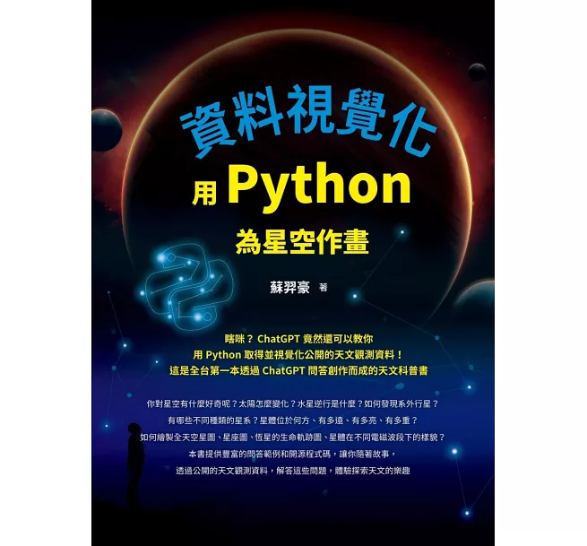

# 《資料視覺化：用Python為星空作畫》書籍相關資訊和程式碼

[《資料視覺化：用Python為星空作畫》](https://www.tenlong.com.tw/products/9786267383186?list_name=r-zh_tw)由[蘇羿豪](https://astrobackhacker.tw/)與ChatGPT協作共寫，程式碼以[MIT授權條款](https://github.com/YihaoSu/exploring-astronomy-with-python-from-data-query-to-visualization/blob/main/LICENSE)釋出(在寫書期間，我原本宣傳的書名為《用Python探索天文：從資料取得到視覺化》，後應出版社要求改為現名）。我會持續透過創作故事、遊戲等有趣體驗來向大眾推廣開放科學，歡迎你加入「[Astrohackers-TW: Python在天文領域的應用](https://www.facebook.com/groups/astrohackers.tw.py)」FB社團，並追蹤「[與AI探索天文](https://www.facebook.com/astroeduai)」粉絲頁及我的[Threads](https://www.threads.net/@astrobackhacker)。

## 書籍內容搶鮮看系列文：
* [《資料視覺化：用Python為星空作畫》新書內容搶鮮看(一)：開放資料與公民科學](https://ithelp.ithome.com.tw/articles/10343561)
* [《資料視覺化：用Python為星空作畫》新書內容搶鮮看(二)：生成式AI時代的科普教育](https://ithelp.ithome.com.tw/articles/10343974)
* [《資料視覺化：用Python為星空作畫》新書內容搶鮮看(三)：遊戲化的天文及程式教育](https://ithelp.ithome.com.tw/articles/10344626)

## 程式碼

* 如何用Python探索太陽觀測資料？ ([notebook程式碼](https://github.com/YihaoSu/exploring-astronomy-with-python-from-data-query-to-visualization/blob/main/notebooks/sun.ipynb)) ([Colab連結](https://colab.research.google.com/github/YihaoSu/exploring-astronomy-with-python-from-data-query-to-visualization/blob/main/notebooks/sun.ipynb))

* 如何用Python探索太陽系天體軌道及位置資料？ ([notebook程式碼](https://github.com/YihaoSu/exploring-astronomy-with-python-from-data-query-to-visualization/blob/main/notebooks/solar_system_objects_orbits.ipynb)) ([Colab連結](https://colab.research.google.com/github/YihaoSu/exploring-astronomy-with-python-from-data-query-to-visualization/blob/main/notebooks/solar_system_objects_orbits.ipynb))

* 如何用Python探索系外行星觀測資料？ ([notebook程式碼](https://github.com/YihaoSu/exploring-astronomy-with-python-from-data-query-to-visualization/blob/main/notebooks/exoplanet.ipynb)) ([Colab連結](https://colab.research.google.com/github/YihaoSu/exploring-astronomy-with-python-from-data-query-to-visualization/blob/main/notebooks/exoplanet.ipynb))

* 如何用Python探索星系觀測資料？ ([notebook程式碼](https://github.com/YihaoSu/exploring-astronomy-with-python-from-data-query-to-visualization/blob/main/notebooks/galaxy.ipynb)) ([Colab連結](https://colab.research.google.com/github/YihaoSu/exploring-astronomy-with-python-from-data-query-to-visualization/blob/main/notebooks/galaxy.ipynb))

* 如何用Python探索星體的位置、距離及亮度？ ([notebook程式碼](https://github.com/YihaoSu/exploring-astronomy-with-python-from-data-query-to-visualization/blob/main/notebooks/coordinates_distance_brightness.ipynb)) ([Colab連結](https://colab.research.google.com/github/YihaoSu/exploring-astronomy-with-python-from-data-query-to-visualization/blob/main/notebooks/coordinates_distance_brightness.ipynb))

* 如何用Python繪製全天空星圖及星座圖？ ([notebook程式碼](https://github.com/YihaoSu/exploring-astronomy-with-python-from-data-query-to-visualization/blob/main/notebooks/all-sky-map_and_constellation.ipynb)) ([Colab連結](https://colab.research.google.com/github/YihaoSu/exploring-astronomy-with-python-from-data-query-to-visualization/blob/main/notebooks/all-sky-map_and_constellation.ipynb))

* 如何用Python探索星體有多重？ ([notebook程式碼](https://github.com/YihaoSu/exploring-astronomy-with-python-from-data-query-to-visualization/blob/main/notebooks/mass_distribution.ipynb)) ([Colab連結](https://colab.research.google.com/github/YihaoSu/exploring-astronomy-with-python-from-data-query-to-visualization/blob/main/notebooks/mass_distribution.ipynb))

* 如何用Python探索星體的生命軌跡圖？ ([notebook程式碼](https://github.com/YihaoSu/exploring-astronomy-with-python-from-data-query-to-visualization/blob/main/notebooks/HRD.ipynb)) ([Colab連結](https://colab.research.google.com/github/YihaoSu/exploring-astronomy-with-python-from-data-query-to-visualization/blob/main/notebooks/HRD.ipynb))

* 如何用Python探索星體在不同電磁波段下的樣貌？ ([notebook程式碼](https://github.com/YihaoSu/exploring-astronomy-with-python-from-data-query-to-visualization/blob/main/notebooks/multiwavelength_astronomy.ipynb)) ([Colab連結](https://colab.research.google.com/github/YihaoSu/exploring-astronomy-with-python-from-data-query-to-visualization/blob/main/notebooks/multiwavelength_astronomy.ipynb))

## 書籍購買管道
你可以透過以下網路平台購買到《資料視覺化：用Python為星空作畫》這本書，但歡迎你到台中的天文主題書店「[仰望書房](https://www.facebook.com/zenith.asbk/)」現場購買、逛逛：
* [博客來](https://www.books.com.tw/products/0010997110?sloc=main)
* [天瓏](https://www.tenlong.com.tw/products/9786267383186)
* [誠品](https://www.eslite.com/product/10012011762682620163006)
* [Readmoo讀墨](https://readmoo.com/book/210345420000101)
* [Kobo](https://www.kobo.com/tw/zh/ebook/python-243)
* [讀冊](https://www.taaze.tw/products/11101043575.html)
* [momo](https://www.momoshop.com.tw/goods/GoodsDetail.jsp?i_code=13119403)
* [PCHome](https://24h.pchome.com.tw/books/prod/DJBQD8-D900HQKOE)
* [墊腳石](https://www.tcsb.com.tw/SalePage/Index/10034338)
* [Google Play圖書](https://play.google.com/store/books/details/%E8%98%87%E7%BE%BF%E8%B1%AA_%E8%B3%87%E6%96%99%E8%A6%96%E8%A6%BA%E5%8C%96_%E7%94%A8Python%E7%82%BA%E6%98%9F%E7%A9%BA%E4%BD%9C%E7%95%AB?id=EyAaEQAAQBAJ&hl=zh_TW)